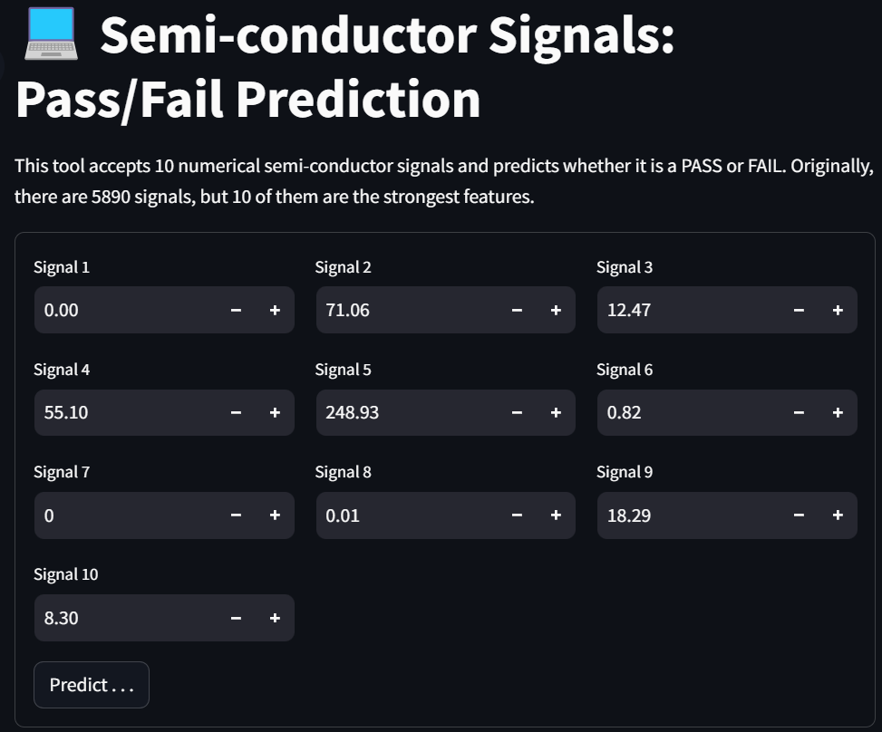
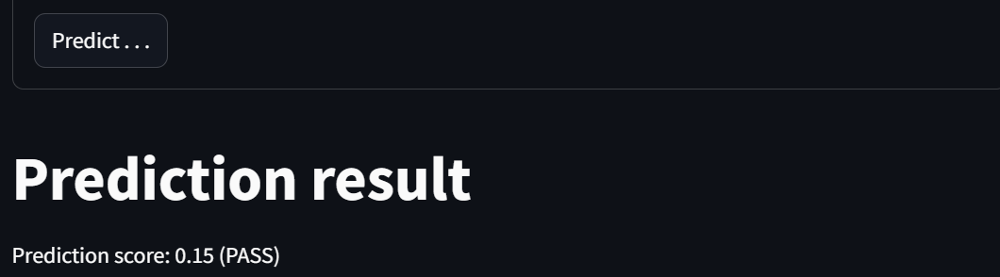
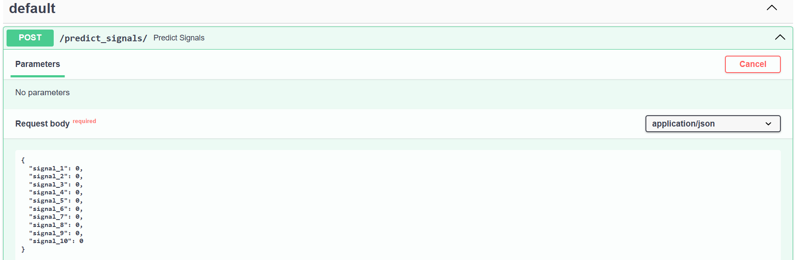

# Semi-conductor-Signals
This tool accepts 10 numerical semi-conductor signals and predicts whether it is a PASS or FAIL.

The model was developed using a Machine Learning algorithm.

Originally, there are 5890 signals, but 10 of them are the strongest features.

# Folders
- 01_data: the dataset used
- 02_notebook: the notebooks of data preparation and Machine Learning development
- 03_outputs: the outpupts from the notebooks
- backend: the backend and API router
- frontend: the user interface

# Environment file
Prepare a ".env" file in the following folders:
- frontend/.env
The file contains the host address "SIGNAL_BACKEND=http://localhost:8081"

# Running the code without Docker  
After intalling all the required libraries in a virtual environment `pip install -r requirements.txt`, 
1. Run the Backend service in backend folder `uvicorn main:app --port 8081`
2. Run the Frontend service in frontend folder `streamlit run app.py`

# Running the code with Docker
## Back-end
1. Build the docker image `docker build -t signals-be .`
2. Run the docker image (on local computer)`docker run -d --publish 8081:8080 --name signals-be signals-be`

## Front-end
1. Build the docker image `docker build -t signals-fe .`
2. Run the docker image (on local computer)`docker run -d -p 8082:8080 --name signals-fe -e SIGNAL_BACKEND=http://172.17.0.1:8081 signals-fe`

# Demonstration
## User interface/frontend

After clicking the "Predict button . . ."

## API
